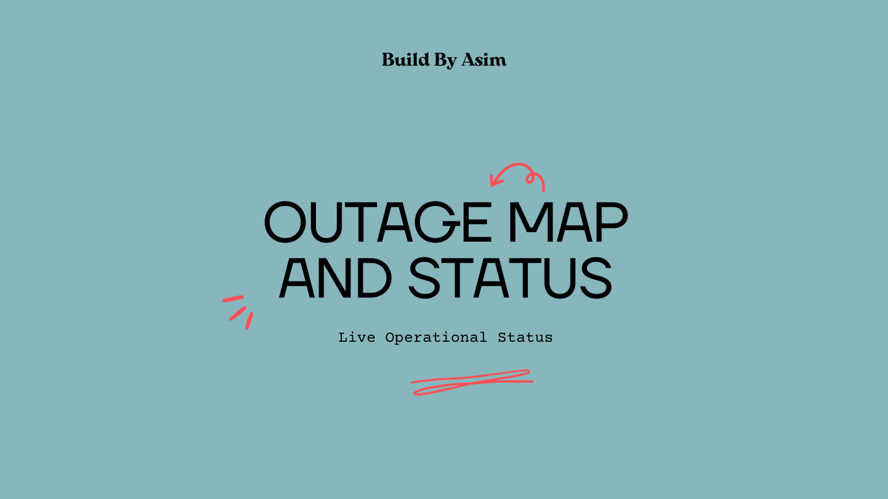
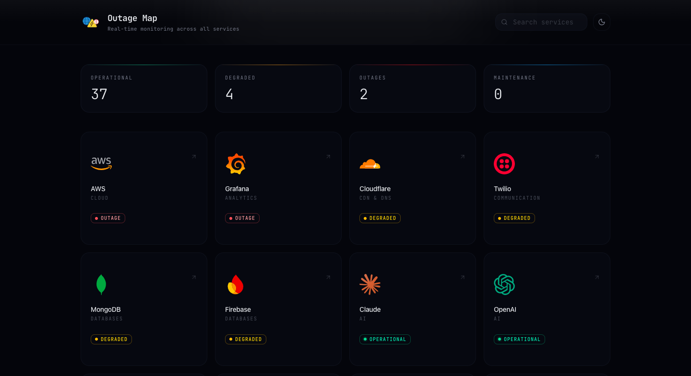

# Outage Map

> Curated directory of official status pages and real-time operational monitoring for major cloud and SaaS services.

**Outage Map** is a live status dashboard built to help you track the health of various cloud infrastructure and SaaS dependencies in real-time.

## ✨ Features

- **Real-Time Monitoring**: Easily track the real-time operational status (Operational, Degraded, Outage, Maintenance) of major services.

- **Search & Filter**: Quickly find full statuses for specific cloud or SaaS services using the built-in search functionality.

- **Modern UI**: Polished, responsive, and visually appealing interface featuring a glassmorphic design and subtle animations.

- **Dark/Light Mode**: Full theme support using `next-themes`.

- **Summary Dashboard**: High-level overview to see counts of operational, degraded, outage, and maintenance statuses at a glance.

## 🌍 URL

Visit the live app at: [https://outagemap.vercel.app](https://outagemap.vercel.app)

## 🤝 Contributing

Contributions are welcome! If you'd like to add a new service to monitor, or improve the application, please open an issue or submit a pull request.

---

Built with ❤️ by Asim

